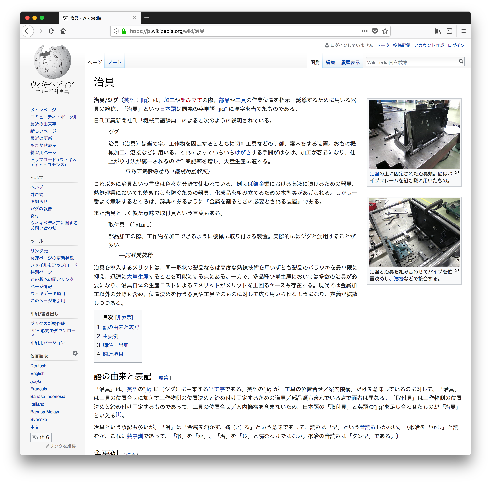

# Study-Bash  

Bash と バッチファイル  

  

[https://ja.wikipedia.org/wiki/治具](https://ja.wikipedia.org/wiki/%E6%B2%BB%E5%85%B7)  

> なんていうかよくわからないけど、手元でまた次の機会に使えるように（作ってみると、もっと良い方法が見つかったりするので次はまた別のものを作ることになることが多いけど）、決め打ち的に使えるマイチートシートというか、治具？というか、本体よりも、そっちを作っていきたいという気持ちがある。

-

> 便利で巨大なライブラリとかプラットホームとかそういうものを絶対使いたくないとかではないけど、その中でわちゃわちゃしまくってたらなんか出来たとかよりも、ミニマムな治具とかそういうものをちまちま作っていきたい。

---  

---  

### index  

- MacOS  
  - rm_DS_Store.sh  
  - Resize.sh  

- WIN  
  - JRG

### Link  

これとかも同じテンションで作っている、  
[http://naysok.org/GH/](http://naysok.org/GH/)
